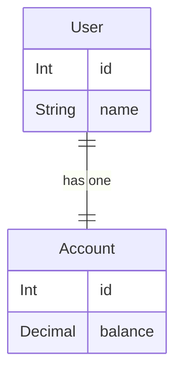
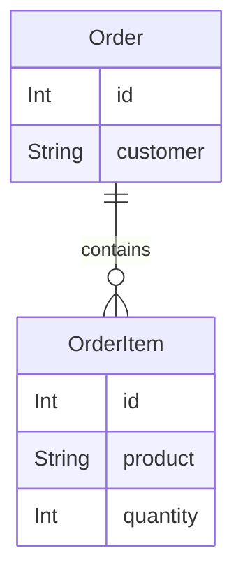
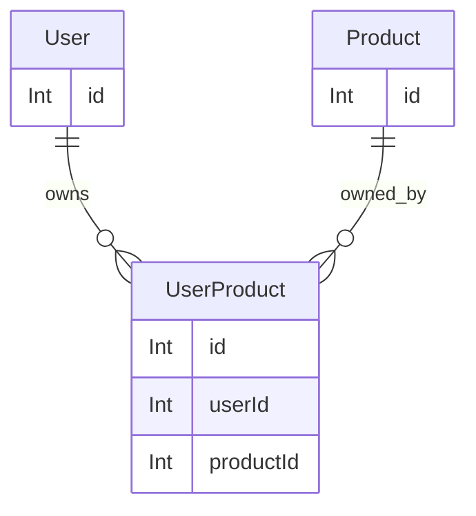

# Schema Conventions (SQL)

This document outlines conventions for structuring PostgreSQL schemas compatible with the code in `src/entities/schemaUtils.ts`. Examples using Mermaid diagrams illustrate one-to-one, one-to-many, and many-to-many relationships.

## Relationship Examples

These examples demonstrate how to define relationships in Prisma schemas.

### One-to-One



**Prisma Schema (Example):**

```prisma
model User {
  id        Int @id @default(autoincrement())
  name      String
  account   Account? @relation(fields: [accountId], references: [id], onDelete: Cascade)
  accountId Int?
}

model Account {
  id        Int @id @default(autoincrement())
  balance   Decimal
}
```

### One-to-Many



**Prisma Schema (Example):**

```prisma
model Order {
  id        Int @id @default(autoincrement())
  customer  String
  orderItems OrderItem[]
}

model OrderItem {
  id        Int @id @default(autoincrement())
  product   String
  quantity  Int
  orderId   Int @relation(fields: [orderId], references: [id], onDelete: Cascade)
}
```

### Many-to-Many



**Prisma Schema (Example):**

```prisma
model User {
  id        Int @id @default(autoincrement())
  products UserProduct[]
}

model Product {
  id        Int @id @default(autoincrement())
  users    UserProduct[]
}

model UserProduct {
  id        Int @id @default(autoincrement())
  userId   Int @relation(fields: [userId], references: [id], onDelete: Cascade)
  productId Int @relation(fields: [productId], references: [id], onDelete: Cascade)
}
```

## Further Considerations

- Use appropriate data types (e.g., `Decimal` for monetary values).
- Define relationships using `@relation` directives in Prisma schemas.
- Consider using `@unique` constraints for fields that need to be unique.
- Ensure data integrity by using Zod validation.

This document provides a starting point for defining PostgreSQL schemas. Consult the Prisma documentation for detailed information.
