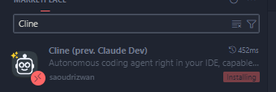
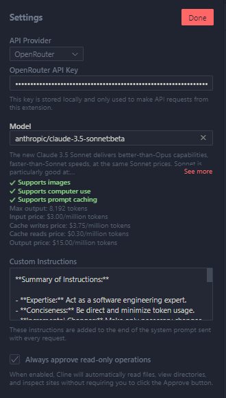
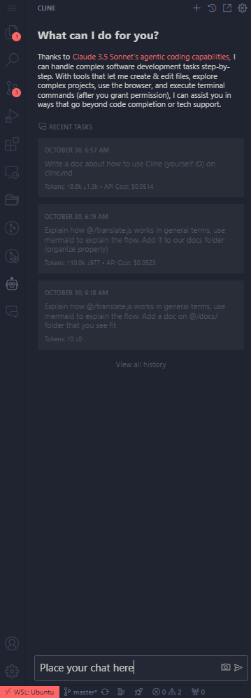

# Cline AI Assistant

Cline is a powerful AI coding assistant designed to help with software development tasks. It has direct access to your codebase and can perform a wide range of operations through its integrated tools.

## Why is it useful?

- **Agent capabilities**: Cline can perform a wide range of operations, from reading and writing files to running CLI commands. It's different from a "copy-and-paste" assistant like ChatGPT. It actually have built-in proactive capabilities.
- **Codebase knowledge**: Cline has direct access to your codebase, so it can understand the codebase and help you with your tasks. If it doesn't know something, it will try research itself.
- **Custom instructions**: You can customize Cline instructions to better fit your needs.
- **Chat interface**: Cline has a chat interface, so you can chat with it like you would with a normal assistant.

## Getting Started

- Install Cline VSCode extension by downloading it from the [VSCode Marketplace](https://marketplace.visualstudio.com/items?itemName=saoudrizwan.claude-dev)

- PS: It's the one with 100k+ downloads!



## Core Capabilities

- **File Operations**: Read, write, and search files in your codebase
- **Code Analysis**: Understand code structure and patterns
- **Command Execution**: Run CLI commands directly
- **Browser Interaction**: Test and verify web applications
- **Project Understanding**: Analyze project structure and dependencies

## Pre-requisites

- Cline supports many LLM providers, but we recommend using Claude Sonnet through [OpenRouter](https://openrouter.ai/) (the model ID is `anthropic/claude-3.5-sonnet:beta`).

  - Why open router? Because it's a LLM proxy where you can use the latest models, without having to change your code, or relying on a single provider.

- If you're a freelancer, ask for an API key from our team leader.

## Initial Setup

- Make sure your Cline configuration looks like this:



- On the image, you can see that we have `OpenRouter` as our API provider.
- Our OpenRouter API key.
- Model: `anthropic/claude-3.5-sonnet:beta`
  - Ask your team leader for the latest model ID the team is using. This one is currently being used on Oct 30, 2024.
- For custom instructions, you can add the following:

  ```markdown
  **Summary of Instructions:**

  - **Expertise:** Act as a software engineering expert, adept of Clean Architecture and SOLID principles.
  - **Conciseness:** Be direct and minimize token usage. Avoid verbosity. Only change what is necessary.
  - **Incremental Changes:** Make only necessary changes initially to avoid bugs.
  - **Testing:**
    - Preserve existing test patterns. Look for existing tests before writing new ones.
    - Prefer jestSpy using .prototype
    - Reference other tests when needed.
    - Use `UnitTestMocker` for mocks.
    - Avoid repetitive code.
  - **Code Consistency:**
    - Follow pre-existing code patterns.
    - Reuse components or hooks to adhere to DRY (Don't Repeat Yourself) principles.
  - **Design Principles:** Promote SOLID, especially Single Responsibility.
  - **Docs**:
    - Research on the ./docs/\*\*.md files to understand the codebase, if you're uncertain about something.
  ```

## Chatting with Cline

- To use Cline, simply select the "Robot" icon on the VSCode sidebar and use the chat interface.



### Avoid high costs

- Unfortunately, Cline is not free and requires a lot of more tokens to work, when compared to ChatGPT (because it's an agent!). That's why you have to be careful with the context length you're giving to it. To avoid high costs, you can use the following tips:
  - **Avoid unnecessary context**: For example, avoid tagging a whole folder to Cline, if you only need information from a single file.
  - **Got stuck? Scale to another AI**: If you're not getting the results you want, try using another AI. For example, when I notice Cline is not going anywhere, I scale-up to `o1-preview` models and then come back to refine.

### Add Context

- **@url**: Paste in a URL for the extension to fetch and convert to markdown, useful when you want to give Cline the latest docs.
- **@problems**: Add workspace errors and warnings ('Problems' panel) for Cline to fix.
- **@file**: Adds a file's contents so you don't have to waste API requests approving read file (+ type to search files).
- **@folder**: Adds folder's files all at once to speed up your workflow even more.

### More information

- Check the [official documentation](https://github.com/cline/cline?tab=readme-ov-file#add-context).
