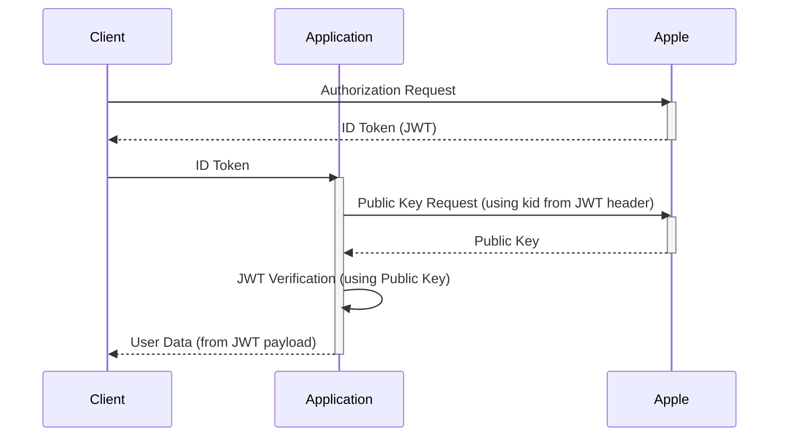
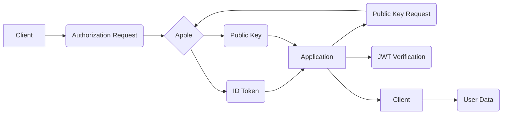

# Apple OAuth 2.0

This document outlines the Apple OAuth 2.0 integration within the application, including setup instructions.

## Overview

The application uses Apple OAuth 2.0 to allow users to authenticate using their Apple accounts. This process leverages JSON Web Tokens (JWTs) for authentication and authorization. The key steps are:

1. **Authorization Request:** The user is redirected to Apple's authorization endpoint.
2. **User Consent:** The user is prompted to grant the application access to specified information.
3. **ID Token:** Upon successful consent, Apple redirects the user back to the application with an ID token (JWT).
4. **ID Token Verification:** The application verifies the ID token's signature and payload using Apple's public keys.
5. **User Information:** The verified ID token payload contains user information.

## Detailed Steps

### 1. Authorization Request

The application initiates the Apple OAuth 2.0 flow by redirecting the user to Apple's authorization endpoint. This request includes parameters such as the client ID, redirect URI, and requested scopes.

### 2. User Consent

The user is presented with a consent screen from Apple, where they can review the requested permissions and grant or deny access.

### 3. ID Token

Upon successful authorization, Apple redirects the user back to the application's redirect URI with an ID token (JWT) as a parameter.

### 4. ID Token Verification

The application uses the `AppleOAuthHelper.verifyIdentityToken()` method to verify the ID token. This method performs the following steps:

1. **Decoding the JWT:** The ID token is decoded to extract the header and payload.
2. **Fetching the Public Key:** The `kid` (key ID) from the JWT header is used to fetch the corresponding public key from Apple's JWKS (JSON Web Key Set) endpoint (`https://appleid.apple.com/auth/keys`).
3. **Signature Verification:** The JWT signature is verified using the fetched public key.
4. **Payload Validation:** The payload is validated to ensure it contains the expected claims and that the token hasn't expired.

### 5. User Information

If the ID token is successfully verified, the payload contains user information such as the user's unique identifier (`sub`), email address (`email`), and other claims.

## Sequence Diagram



## Data Flow Diagram



## Setting up Apple OAuth 2.0

1. **Create an Apple Developer Account:** You need an Apple Developer account.
2. **Create an App ID:** Create an App ID in your Apple Developer account. Enable Sign in with Apple.
3. **Configure Services:** Configure the Sign in with Apple service for your app ID. This includes setting the return URLs (redirect URIs).
4. **Generate a Private Key:** Generate a private key for your app. Keep this key secure!
5. **Register Services:** Register your services with Apple.
6. **Implement the OAuth 2.0 Flow:** Implement the OAuth 2.0 flow in your application as described above.

## Error Handling

The `AppleOAuthHelper` class includes error handling for various scenarios, such as network errors, invalid tokens, and signature verification failures. Appropriate error messages are returned to the client.

## Security Considerations

- Private keys are stored securely.
- ID tokens are verified to prevent unauthorized access.
- User information is handled securely.

## Code Example (verifyIdentityToken)

```typescript
public async verifyIdentityToken(identityToken: string): Promise<IAppleIdentityTokenResponse | null> {
    const json = jwt.decode(identityToken, { complete: true }) as any;

    if (json) {
      const keyId = json.header.kid;
      const applePublicKey = await this.getAppleSigningKey(keyId);

      if (!applePublicKey) {
        throw new BadRequestError("Oops! Something went wrong.");
      }

      const payload = this.verifyJWT(identityToken, applePublicKey);

      if (!payload) {
        throw new BadRequestError("Oops! Something went wrong.");
      }

      return payload;
    }

    return null;
  }
```
