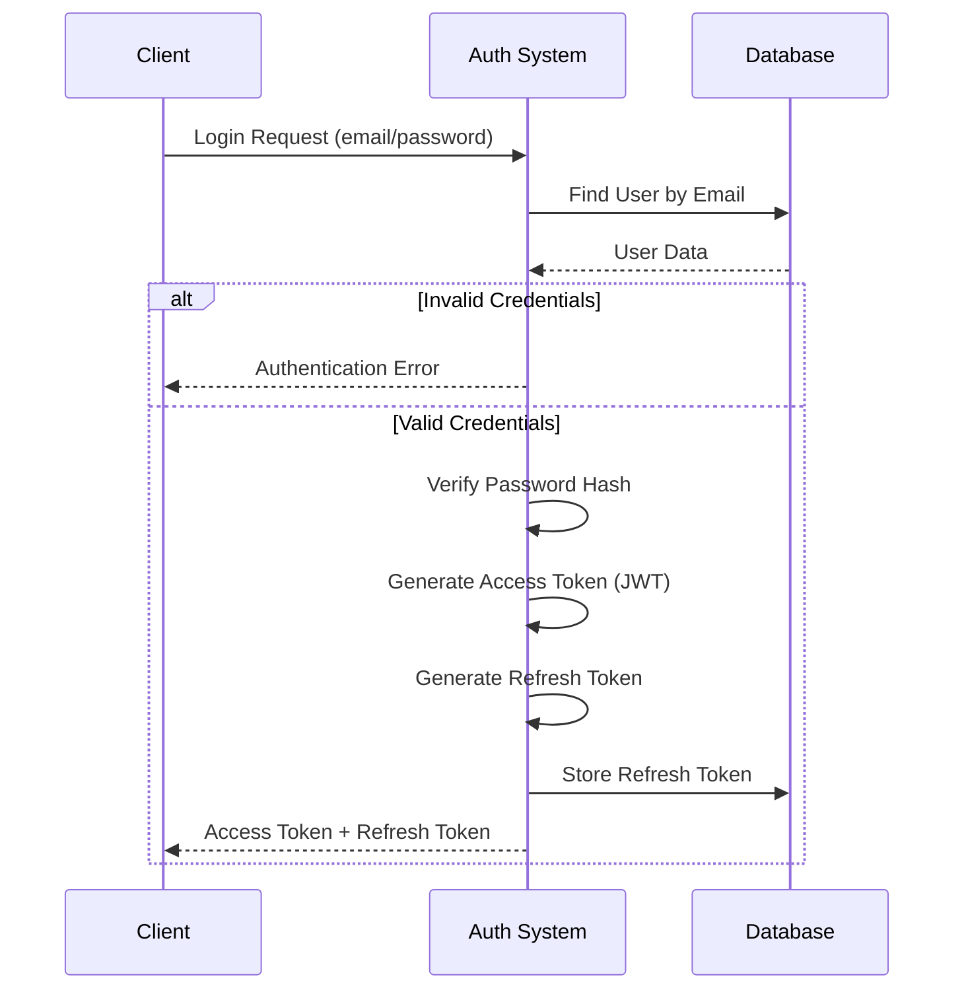
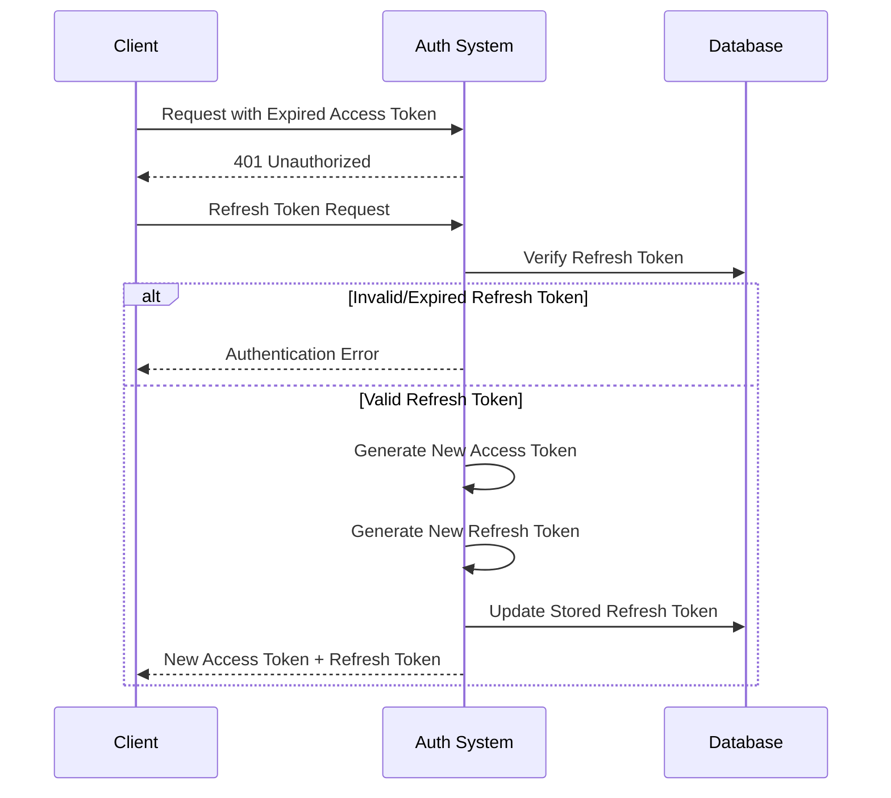
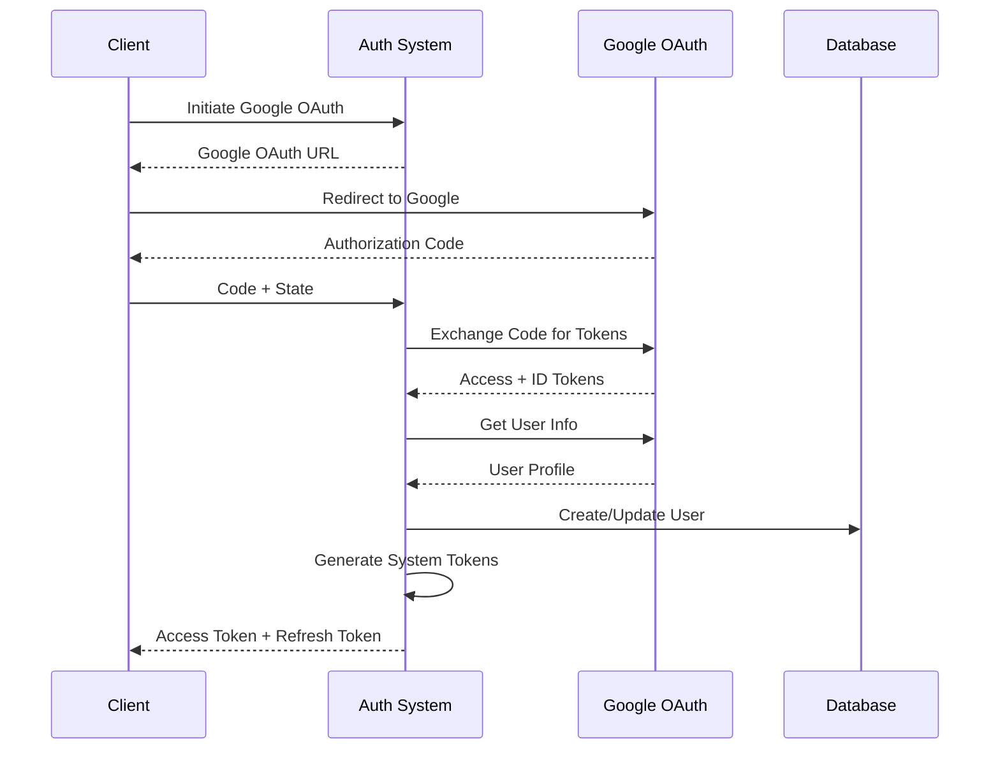
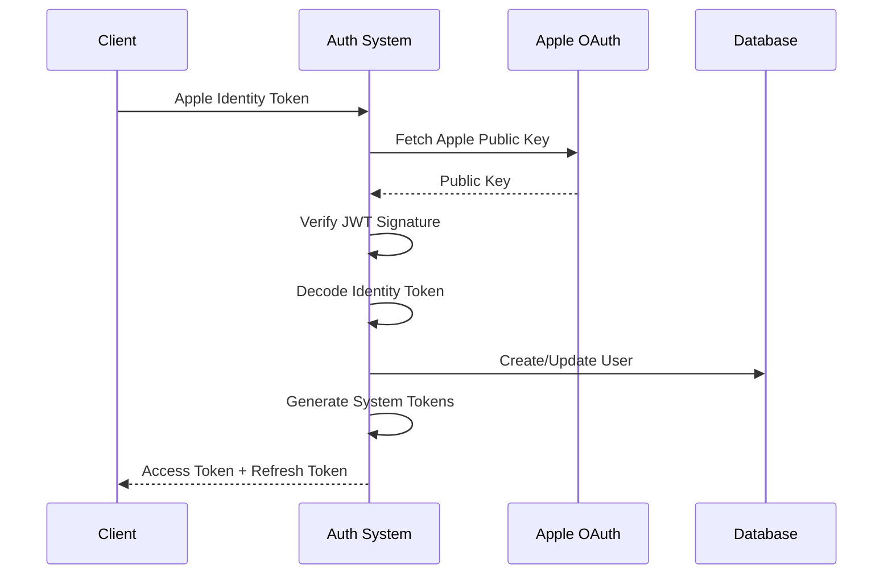

# Authentication

## Overview

The authentication system supports multiple authentication flows:

- Basic authentication (email/password)
- Google OAuth
- Apple OAuth

The system uses a combination of JWT access tokens and refresh tokens for maintaining user sessions.

## Main Authentication Flow

## Token Refresh Flow

## Google OAuth Flow

## Apple OAuth Flow

## Key Components

### UserAuth

- Handles core authentication logic
- Manages access token generation
- Verifies user credentials
- Integrates with refresh token system

### AuthRefreshToken

- Manages refresh token lifecycle
- Stores tokens in user document
- Validates refresh tokens
- Handles token rotation

### EncryptionHelper

- Provides generic encryption/decryption capabilities
- Uses Cryptr for symmetric encryption
- Configured with environment-specific encryption key

### OAuth Helpers

- GoogleOAuthHelper: Manages Google OAuth flow
- AppleOAuthHelper: Handles Apple Sign-in verification

## Security Features

1. **Password Security**

   - Passwords are hashed using bcrypt
   - Each user has a unique salt
   - Password hashes are recalculated when needed

2. **Token Security**

   - Access tokens expire after 20 minutes (production)
   - Refresh tokens are stored and validated
   - Invalid refresh tokens are rejected
   - Ability to invalidate all refresh tokens for a user

3. **OAuth Security**
   - Validates OAuth tokens with providers
   - Verifies token signatures
   - Handles OAuth state validation
   - Supports different auth flows per user

## Environment Configuration

The authentication system requires several environment variables:

- JWT_SECRET: For signing JWTs
- REFRESH_TOKEN_SECRET: For refresh token generation
- GOOGLE_CLIENT_ID: For Google OAuth
- GOOGLE_SECRET: For Google OAuth
- Generic encryption hash for EncryptionHelper

## Best Practices

1. **Token Management**

   - Store refresh tokens securely
   - Rotate refresh tokens on use
   - Clear expired/invalid tokens
   - Support token revocation

2. **Error Handling**

   - Specific error types for different scenarios
   - Clear error messages with translations
   - Proper error propagation

3. **Security**
   - Secure password storage
   - Token validation
   - OAuth provider verification
   - Environment-specific configurations
