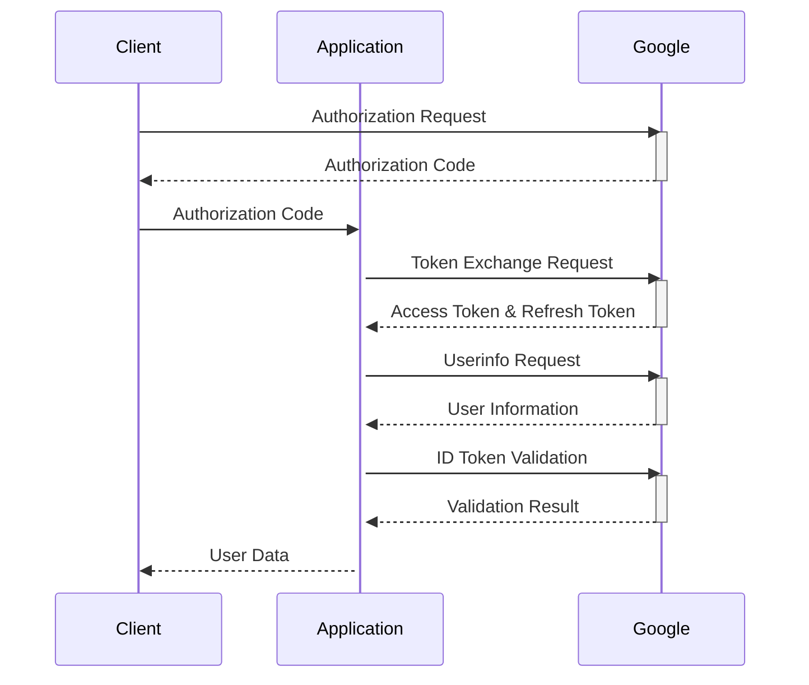
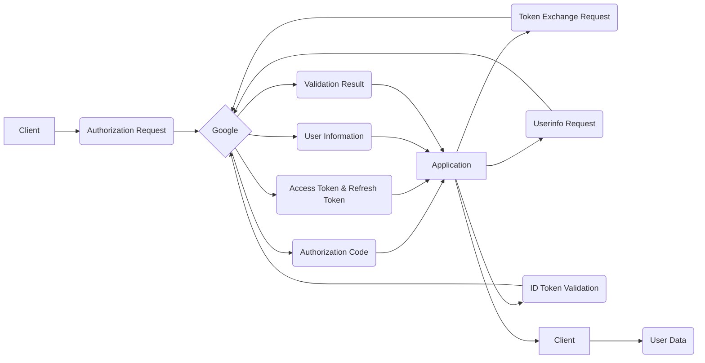

# Google OAuth 2.0

This document outlines the Google OAuth 2.0 integration within the application, including setup instructions.

## Overview

The application uses Google OAuth 2.0 to allow users to authenticate using their Google accounts. This process involves several steps:

1. **Authorization Request:** The user is redirected to a Google authorization URL. This URL includes the client ID, redirect URI, and requested scopes.
2. **User Consent:** The user is prompted to grant the application access to the specified scopes (e.g., profile information, email).
3. **Authorization Code:** Upon successful consent, Google redirects the user back to the application's redirect URI with an authorization code.
4. **Token Exchange:** The application exchanges the authorization code for an access token and a refresh token using the Google OAuth 2.0 token endpoint.
5. **User Information Retrieval:** The application uses the access token to retrieve the user's profile information from the Google Userinfo endpoint.
6. **ID Token Validation:** The application validates the ID token received from Google to verify the user's identity.

## Detailed Steps

### 1. Authorization Request

The application generates a Google authorization URL using the `GoogleOAuthHelper.urlGoogle()` method. This URL includes:

- `client_id`: The application's Google client ID.
- `redirect_uri`: The application's redirect URI.
- `scope`: The requested scopes (profile information and email).
- `access_type`: `offline` to obtain a refresh token.
- `prompt`: `consent` to force the user to grant consent each time.

### 2. User Consent

The user is redirected to the Google authorization URL and prompted to grant the application access to the requested scopes.

### 3. Authorization Code

After the user grants consent, Google redirects the user back to the application's redirect URI with an authorization code in the URL's query parameters.

### 4. Token Exchange

The application uses the `GoogleOAuthHelper.getAccessTokenFromCode()` method to exchange the authorization code for an access token and a refresh token. This method makes a POST request to the Google OAuth 2.0 token endpoint with the following parameters:

- `client_id`: The application's Google client ID.
- `client_secret`: The application's Google client secret.
- `redirect_uri`: The application's redirect URI.
- `grant_type`: `authorization_code`.
- `code`: The authorization code received from Google.

The response contains the access token, refresh token, token type, and expiration time.

### 5. User Information Retrieval

The application uses the `GoogleOAuthHelper.getGoogleUser()` method to retrieve the user's profile information. This method makes a GET request to the Google Userinfo endpoint with the access token in the `Authorization` header.

### 6. ID Token Validation

The application uses the `GoogleOAuthHelper.validateIdToken()` method to validate the ID token received from Google. This method uses the `google-auth-library` to verify the ID token's signature and ensure that it was issued for the application's client ID.

## Sequence Diagram



## Data Flow Diagram



## Setting up Google OAuth 2.0

1. **Access Google Cloud Project:** Ask for a Google Cloud project with the Google People API enabled.
2. **Enable the Google People API:** In your Google Cloud project, enable the Google People API.
3. **Create OAuth 2.0 Client ID:** Create an OAuth 2.0 client ID. Choose "Web application" as the application type. Set the authorized redirect URIs to match your application's redirect URI (e.g., `http://localhost:3000/auth/google/redirect` for development).
4. **Configure Environment Variables:** Set the following environment variables with your client ID and secret:
   - `GOOGLE_CLIENT_ID`: Your Google OAuth 2.0 client ID.
   - `GOOGLE_SECRET`: Your Google OAuth 2.0 client secret.
5. **Implement the OAuth 2.0 Flow:** Implement the OAuth 2.0 flow in your application as described in the previous sections.

## Error Handling

The `GoogleOAuthHelper` class includes error handling for various scenarios, such as network errors and invalid tokens. Appropriate error messages are returned to the client.

## Security Considerations

- Client secrets are stored securely in environment variables.
- Access tokens and refresh tokens are handled securely to prevent unauthorized access.
- The application validates ID tokens to prevent unauthorized access.

## Code Example (getGoogleUser)

```typescript
public async getGoogleUser(code: string): Promise<any> {
    const payload: IGoogleOAuthTokenPayload = await this.getAccessTokenFromCode(code);

    // Fetch the user's profile with the access token and bearer
    const googleUser = await axios
      .get(`https://www.googleapis.com/oauth2/v1/userinfo?alt=json&access_token=${payload.access_token}`, {
        headers: {
          Authorization: `Bearer ${payload.id_token}`,
        },
      })
      .then((res) => res.data)
      .catch((error) => {
        throw new InternalServerError(error.message);
      });

    return googleUser;
  }
```
