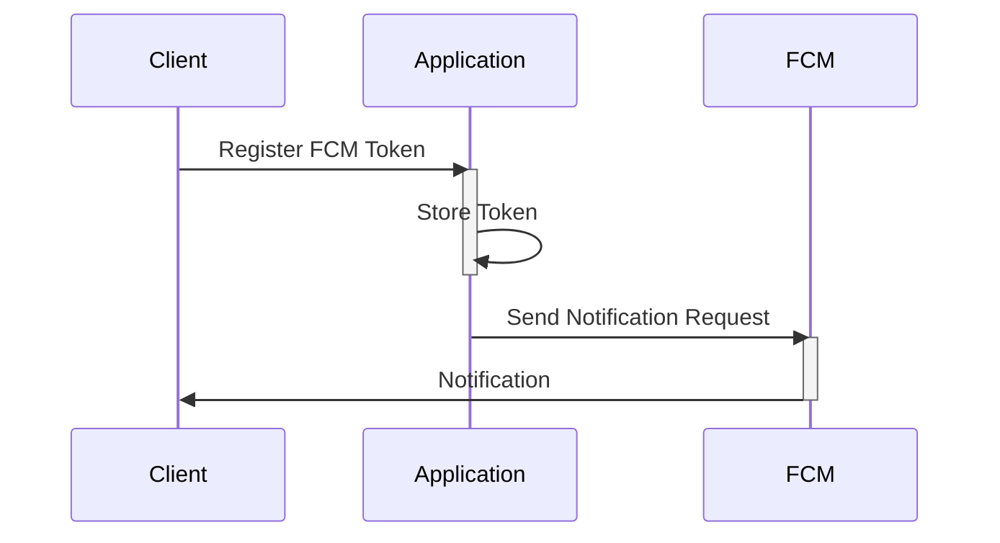

# Push Notification System

This document describes the push notification system used in the application.

## Overview

The application uses Firebase Cloud Messaging (FCM) to send push notifications to users' devices. This system allows for sending targeted messages to individual users or groups of users based on various criteria.

## Sending Push Notifications

Push notifications are sent using the `PushNotificationHelper.sendMessage()` method. This method takes the following parameters:

- `userToken`: The user's FCM registration token.
- `title`: The title of the notification.
- `body`: The body of the notification.
- `data`: (Optional) Additional data to be included in the notification payload.

The method sends a message to the specified token using FCM. If the token is invalid (e.g., the user has uninstalled the app), the method attempts to update the user's token in the database to an empty string.

## Error Handling

The `sendMessage` method includes error handling for various scenarios, such as network errors and invalid tokens. Appropriate logging is performed for debugging purposes. If a token is invalid, the corresponding user's token is updated to an empty string in the database.

## Security Considerations

- User tokens are stored securely in the database.
- The application uses FCM's security features to ensure that notifications are only sent to authorized users.

## Setup

1. **Firebase Project Setup:** Ensure you have a Firebase project set up.
2. **Firebase Admin SDK:** Install the Firebase Admin SDK: `npm install firebase-admin`
3. **Firebase Configuration:** Configure the Firebase Admin SDK with your project credentials. This typically involves setting the `GOOGLE_APPLICATION_CREDENTIALS` environment variable to point to your service account key file.
4. **FCM Registration Tokens:** Users must register their FCM registration tokens with the application. This token is typically obtained when the user installs and opens the application.
5. **Server-Side Implementation:** Implement the server-side logic to send push notifications using the `PushNotificationHelper` class.

## Sequence Diagram

